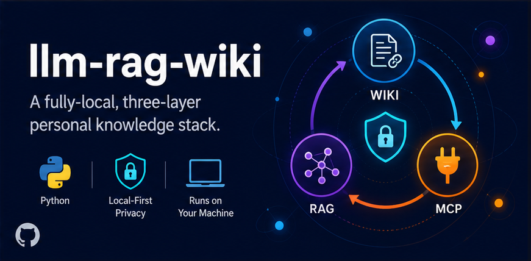

<p align="center">
  
</p>

<h1 align="center">llm-rag-wiki</h1>

<p align="center">
  <strong>A fully-local, three-layer personal knowledge stack expanding Karpathy's llm-wiki.</strong>
</p>

<p align="center">
  <a href="LICENSE"></a>
  <a href="#"></a>
  <a href="#"></a>
  <a href="#"></a>
  <a href="#"></a>
</p>

---

## Overview

**llm-rag-wiki** is a local-first knowledge system designed for **developers**, **data scientists**, and advanced **end-users** who want private, structured, and AI-ready knowledge workflows.

It combines three integrated layers:

- **Wiki layer** 📚: turns dropped source files into a structured Markdown wiki with cross-references.
- **RAG layer** 🧠: chunks, embeds, and retrieves from the wiki for grounded answers.
- **MCP layer** 🤝: exposes local personas and wiki context to MCP-aware AI tools.

**End-to-end flow:** drop a file in `entry` -> run autoconvert + ingest -> wiki grows (cross-refs + contradiction checks) -> RAG re-indexes -> MCP-aware AI sessions can query your wiki and adopt your local personas, all **without sending data off-machine**.

---

## Table of Contents

- [Overview](#overview)
- [Key Features](#key-features)
- [Architecture](#architecture)
- [Getting Started](#getting-started)
  - [Prerequisites](#prerequisites)
  - [Installation](#installation)
- [Usage](#usage)
- [Roadmap](#roadmap)
- [Contributing](#contributing)
- [License](#license)

---

## Key Features

- **Fully local and privacy-first** 🔒
- **Three-layer architecture**: Wiki + RAG + MCP
- **Deterministic ingestion/retrieval pipeline**
- **Cross-reference growth and contradiction signaling**
- **Persona-aware AI context via local MCP server**
- **Designed for repeatable, auditable knowledge workflows**

---

## Architecture

```text
[Source files in entry/]
          |
          v
   Wiki Conversion Layer
 (normalize + structure + links)
          |
          v
      wiki/ (Markdown KB)
          |
          v
      RAG Ingestion Layer
   (chunk + embed + index)
          |
          v
     Local Vector Store
          |
          v
     Retrieval + MCP Layer
 (query wiki + inject personas)
```

---

## Getting Started

### Prerequisites

- **Python 3.11+**
- **Git**
- (Optional) `venv` for isolated environments

### Installation

1. **Clone the repository**
   ```bash
   git clone https://github.com/<your-org>/llm-rag-wiki.git
   cd llm-rag-wiki
   ```

2. **Create and activate a virtual environment**
   ```bash
   python -m venv .venv
   source .venv/bin/activate
   ```

3. **Install core dependencies**
   ```bash
   pip install -e .
   ```

4. **Install optional extras (recommended for full stack)**
   ```bash
   pip install -e ".[rag,mcp,dev]"
   ```

---

## Usage

A minimal local workflow:

```bash
# 1) Convert and ingest local knowledge into the wiki + RAG index
python -m wiki.autoconvert
python -m rag.ingest

# 2) Retrieve grounded context from your local knowledge base
rag-retrieve --query "What changed in the ingestion pipeline?"

# 3) Start the local MCP persona server
persona-mcp
```

> If your command/module entrypoints differ, adjust to your local scripts in `src/` and `pyproject.toml`.

---

## Roadmap

- [ ] Improve contradiction detection precision
- [ ] Add richer source provenance views
- [ ] Expand MCP persona composition controls
- [ ] Provide one-command bootstrap for first-time setup

---

## Contributing

Contributions are welcome! 🚀

1. Fork the repo
2. Create a feature branch (`git checkout -b feature/your-change`)
3. Commit your changes (`git commit -m "Add: your change"`)
4. Push your branch (`git push origin feature/your-change`)
5. Open a Pull Request

For larger changes, please open an issue first to discuss scope and design.

---

## License

This project is licensed under the **MIT License** (placeholder).  
See [LICENSE](LICENSE) for details.
